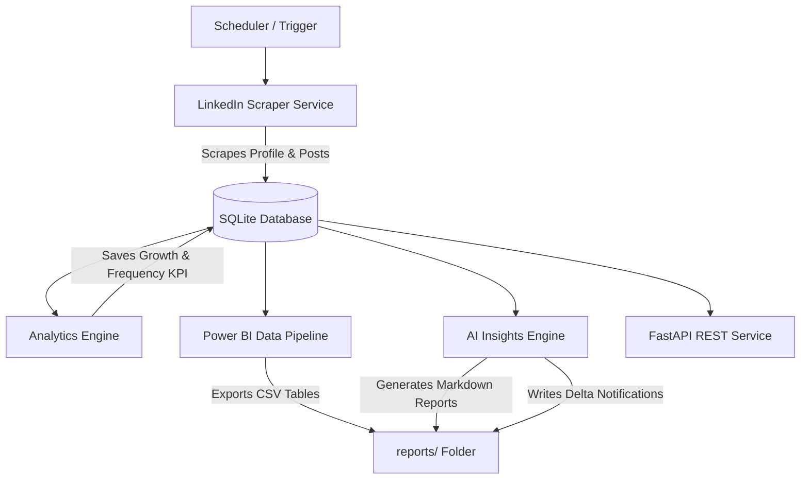

# LinkedIn AI Analytics Dashboard & Automation Platform

A production-ready platform designed to automatically scrape LinkedIn profile snapshots and posts, compute advanced statistical analytics, generate AI-driven forecasts, and output clean datasets for Power BI dashboard integration.

---

## 1. Project Overview & Architecture

The platform operates on a modular pipeline structure:



- **Data Scraper**: Headless browser automation (Playwright) that securely manages sessions and extracts profile credentials and post statistics.
- **Analytics Engine**: Calculates posting frequency, weekday statistics, best/worst posts, and growth rates.
- **Power BI Pipeline**: Publishes SQL reporting views and auto-refreshes CSV reports.
- **AI Engine**: Forecasts audience growth using linear regression and next-post engagement via weighted moving averages.
- **FastAPI Layer**: Exposes read-only REST endpoints for web dashboard integration.

---

## 2. Folder Structure

```text
linkedin_ai_dashboard/
├── dashboard/               # Power BI assets, custom JSON theme, and SVG icons
│   ├── Dashboard_Icons/     # SVG vectors for KPI indicator blocks
│   ├── Dashboard_Theme.json # Dark Blue custom visual report theme
│   ├── Measures.sql         # DAX formulas for Power BI Desktop calculations
│   └── ...                  # Visual layout coordinate details
├── data/                    # SQLite database and session configuration
│   ├── linkedin.db          # Active SQLite Database
│   └── session.json         # Encrypted browser credentials session
├── logs/                    # Application and runtime execution logs
├── reports/                 # Output CSVs, summaries, and monthly reports
│   ├── monthly_ai_report.md # Generated AI monthly review
│   ├── daily_summary.md     # 24h delta tracking report
│   ├── monthly_summary.md   # 30d delta tracking report
│   └── *.csv                # Refreshed reporting datasets
├── src/                     # Source package root
│   ├── ai/                  # AI Insights and recommendations services
│   ├── analytics/           # Analytics calculation & Power BI pipeline exports
│   ├── auth/                # Browser login and cookie handlers
│   ├── dashboard/           # FastAPI REST API implementation
│   ├── database/            # Models, DB managers, and repository layer
│   └── scraper/             # Profile and posts scrapers
└── run_*.py                 # Automation script runners and tests
```

---

## 3. Installation & Configuration

### Prerequisites
- Python 3.10+
- Google Chrome or Chromium

### Setup Steps
1. **Clone and Navigate**:
   ```powershell
   cd C:\Users\aparn\OneDrive\Documents\linkedin_ai_dashboard
   ```
2. **Initialize Virtual Environment**:
   ```powershell
   python -m venv venv
   .\venv\Scripts\activate
   ```
3. **Install Dependencies**:
   ```powershell
   pip install -r requirements.txt
   playwright install chromium
   ```
4. **Environment Variables**:
   Create a `.env` file at the root:
   ```ini
   LINKEDIN_SESSION_PATH=data/session.json
   BROWSER_HEADLESS=True
   LOGIN_TIMEOUT_MS=120000
   ```

---

## 4. Running the Platform

### A. Run a Manual Full Pipeline Cycle
To trigger a scraper, analytics calculation, CSV refresh, and AI report generation cycle immediately:
```powershell
.\venv\Scripts\python.exe src/main.py
```

### B. Run the Background Scheduler
To start the persistent scheduler (polls hourly and executes daily, weekly, and monthly tasks):
```powershell
.\venv\Scripts\python.exe run_scheduler.py --daemon --interval 3600
```
To run the scheduler task once immediately:
```powershell
.\venv\Scripts\python.exe run_scheduler.py --run-now
```

### C. Run the REST API Service
To launch the FastAPI REST service:
```powershell
.\venv\Scripts\python.exe -m uvicorn src.dashboard.api:app --reload --host 127.0.0.1 --port 8000
```
Access the Swagger interactive documentation at: [http://127.0.0.1:8000/docs](http://127.0.0.1:8000/docs).

---

## 5. Power BI Dashboard Integration

1. **Import Custom Theme**:
   - In Power BI Desktop, go to **View** -> **Themes** dropdown -> **Browse for themes** -> Select `dashboard/Dashboard_Theme.json`.
2. **Connect to CSVs**:
   - Choose **Get Data** -> **Text/CSV** -> Select files from `reports/` directory.
3. **Establish Data Model**:
   - Create a DAX Calendar table (`Calendar = CALENDARAUTO()`) and map relationships to `post_performance[post_date]` and `followers_growth[date]`.
4. **Insert DAX Measures**:
   - Copy formulas from `dashboard/Measures.sql` into a measures table in your model.
5. **Layout Placement**:
   - Follow coordinate rules in `dashboard/Dashboard_Layout.md` to design visual pages in under an hour.

---

## 6. AI Features
- **Follower Growth Prediction**: Extrapolates future follower gains over the next 30 days using linear regression.
- **Engagement Prediction**: Estimates future engagement rates for upcoming posts using weighted moving averages of the last 5 posts.
- **Dynamic Content Optimization**: Suggests hashtags, word counts, optimal publication hours, and categories by analyzing historical post performance in the SQLite database.

---

## 7. Future Enhancements
- **Multi-profile Tracking**: Support tracking performance for team members or concurrent corporate pages.
- **Natural Language Querying**: Integrate an LLM agent to allow users to ask conversational questions about their analytics data.
- **Alert Integrations**: Add Webhooks to post daily and monthly markdown summaries directly to Slack or Microsoft Teams.

---

## 8. Automating LinkedIn Connections Scraping

By default, connections scraping requires an active session cookie and has been separated from the daily automated `src/main.py` script to avoid overhead. To fully automate connections updates as part of the main scraper execution:

1. Open [src/main.py](file:///c:/Users/aparn/OneDrive/Documents/linkedin_ai_dashboard/src/main.py).
2. Under the post scraping segment (around line 69), insert the following lines of code:
```python
        # Run Connections Scraper Service
        logger.info("Triggering Connections Scraper Service...")
        from src.scraper.connections_service import LinkedInConnectionsService
        connections_service = LinkedInConnectionsService(db_manager.repository)
        inserted, skipped, source = await connections_service.execute_connections_import()
        logger.info(f"Connections scraped successfully. Source: {source} (New: {inserted}, Skipped/Updated: {skipped})")
```
3. Save the file. The scheduler and direct executions will now automatically scrape and sync connection records.

